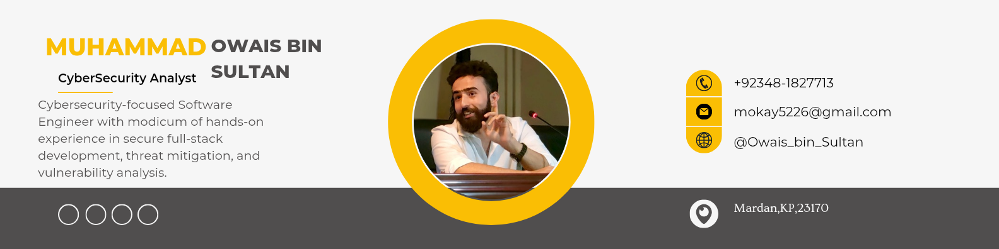

# 👋 Hi, I'm Muhammad Owais Khan

🎓 **Cybersecurity-focused Software Engineer** with a passion for building resilient, scalable, and innovative solutions.  
🔐 Blending full-stack development with cybersecurity fundamentals to safeguard digital infrastructure.  
💡 Currently pursuing Computer Software Engineering at **NUST**.

---

## 🛠️ Tech Stack

- **Languages**: C/C++, Python, Java, SQL, HTML/CSS  
- **Frameworks/Tools**: MERN Stack, Flutter, Node.js, OpenCV  
- **Cybersecurity Tools**: Kali Linux, Wireshark, SIEM (basic)  
- **Soft Skills**: Leadership | Teamwork | Critical Thinking

---

## 🚀 Projects

### 🌐 [Forever Horizon – Women Entrepreneurship Platform](https://github.com/Owais-bin-Sultan/Horizon_Forever.git)
*Semester Project – Web Engineering (Dec 2024)*  
> Empowering rural women entrepreneurs through a dynamic MERN-based platform.  

- **Tech:** MongoDB, Express.js, React, Node.js, Figma  
- **Features:** Skill-building resources, networking, mentorship  
- **Highlights:** UX-focused frontend, secure backend, responsive design

---

### 📱 [FitFusion – Fitness Management App](https://github.com/Owais-bin-Sultan/FitFusion.git)
*Semester Project – Database Systems (May 2024)*  
> A comprehensive fitness tracking app to help users manage workouts and diets.

- **Tech:** Flutter, MySQL, REST API  
- **Features:** Personalized plans, authentication, clean UI  
- **Focus:** CRUD operations, mobile responsiveness

---

### 🧵 [StitchCraft – Custom Tailoring Platform](https://github.com/Owais-bin-Sultan/StitchCraft.git)
*Semester Project – Object Oriented Programming (Dec 2023)*  
> Connects customers with custom tailors for personalized fashion orders.

- **Tech:** Java, Node.js, AWS  
- **Concepts:** OOP, cloud hosting  
- **Value:** Real-world application of backend services

---

### 🧠 [JPEG Image Compression Tool](https://github.com/Owais-bin-Sultan/JPEG-Image-Compression-.git)
*Data Structures & Algorithms (May 2024)*  
> Efficient JPEG compression using Huffman coding and OpenCV.

- **Tech:** Python, OpenCV  
- **Concepts:** Huffman Tree, Data Compression  
- **Outcome:** Significant image size reduction without quality loss

---

### 📊 [Attendance Management System](https://github.com/Owais-bin-Sultan/Attendence_App.git)
*Full-Stack Developer (Aug 2024)*  
> Real-time, WebSocket-powered attendance tracking system.

- **Tech:** HTML, CSS, PHP, Node.js, MongoDB, WebSocket  
- **Features:** Live updates, role-based access  
- **Goal:** Efficient classroom/office attendance management

---

## 🏆 Honors & Certifications

- 🥇 **Gold Medalist** – 1st Position in Pre-Engineering (Cadet College Kohat)  
- 🎓 Foundations of Cybersecurity  
- 🛠️ Getting Started with Flutter Development  
- 🐧 Linux & SQL Tools  
- 🖥️ Intro to Front-End Development

---

## 📫 Connect with Me

- 🌐 [LinkedIn](https://www.linkedin.com/in/mokay5226)
- 📧 Email: mokhan.bese22seecs@seecs.edu.pk
- 📍 Mardan, Khyber Pakhtunkhwa, Pakistan

---

> “Leadership is not about being in charge. It is about taking care of those in your charge.”  
— Muhammad Owais Khan
